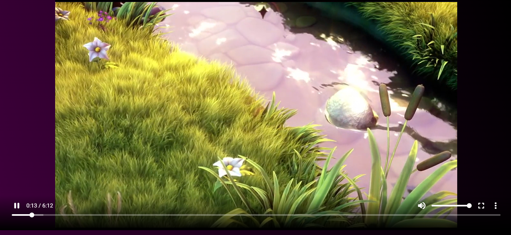

# Toffee Player

#### A simple website built with react to showcase contents and video playing capability.

Live demo: https://toffee-player.vercel.app/

## 🚀 Project setup

Use git to clone the project.

```bash
git clone https://github.com/anmspro/toffee-player.git
```

Enter the project.

```bash
cd toffee-player
```

Use npm to install dependencies.

```bash
npm i
```

## ☄️ Usage

Compiles and hot-reloads for development

```bash
npm start
```

Runs the app in the development mode.\
Open [http://localhost:3000](http://localhost:3000) to view it in your browser.

### 🛠️ Technologies

The following tools were used in the construction of the project:

- React
- Tailwind CSS
- Shaka Player

## 👷‍♂️ Author

<a href="https://github.com/anmspro">
 
 <br />
 <sub><b>Abu Noman Md Sakib</b></sub></a> <a href="https://github.com/anmspro" title="Github">🚀</a>

Content:
<br />

<br />

Player:
<br />

<br />

Other:
<br />

<br />
